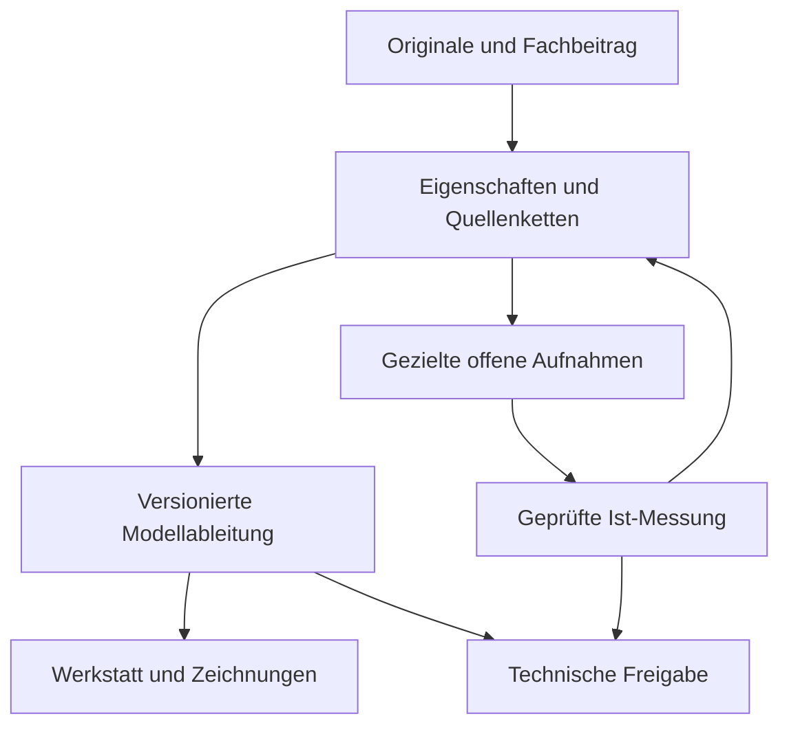

# Momentum-Baseline — 09.10.2026

**Prüfbasis:** `main 118e5f7da51a89eaf04bfe85072169e902f4b532`, Auditbranch ab `7bff8234729b466507b1e59d021f98172f1c7c59`. Unabhängige Prüfung der vorhandenen Arbeit; ausschließlich Plan, Diagnose und Nachweise. Keine Produkt- oder Geometrieänderung.

Der belastbare Fortschritt ist erheblich: 39 Fachkorrekturen sind kanonisch erhalten, die ITER-003-Geometrie wird tatsächlich gebaut und ausgeliefert, und die vier Anwendungstests sind am integrierten PR-Head grün. Instabil wird das Projekt dort, wo unterschiedliche Arten von „fertig“ zusammenfallen: fachlich beschrieben, modelliert, getestet, veröffentlicht und am realen Rad freigegeben. Diese Zustände müssen getrennt sichtbar werden. Eine neue Plattform ist dafür nicht erforderlich.

## Autoritativer Stand und Zuständigkeit

| Bestand | Verifizierter Stand | Autorität / nächste Behandlung |
|---|---|---|
| main / PR #15 | Merge `118e5f7`, integrierter Head `6a19868`; Build+Deploy 37994601533 erfolgreich | Aktuelle Anwendung und Runtime; technische Pflege bei Repository-Verantwortlichem Hannes, Ausführung durch beauftragten Agenten |
| PR #11 | offen; `0bba10b`, 21 Commits hinter main, ein eigener Commit | Nur R1/R4-Auftrag, **keine implementierten Fixes**. Nach Entscheidung auf aktuellem main fortsetzen; alte UX-Beobachtungen als versionierte Befunde behalten |
| PR #12 | offen; `609082b`, 21 hinter main, ein eigener Commit | Nur sieben-Video-Auftrag; keine MOV-Originale, Timecodes oder Auswertung im Branch. Quellenintake zuerst, kein impliziter Abschluss |
| PR #14 | offen; `05b5435`, 19 hinter main, ein eigener Commit mit 16 Auditdateien | Historischer unabhängiger Befund gegen `6999e93`, nicht aktueller Produktcode. F01/F04/F05 durch #15 adressiert; F02/F03 bleiben offen. Bericht nicht rückwirkend umschreiben |
| PR #16 | initial Draft; ein eigener Auftragscommit auf main | Dieser Audit und Stabilisierungsvorschlag; kein Freigabe- oder Umsetzungssammel-PR |
| Thorsten-Fachbeitrag | 39/39 Werte im Kanon unverändert gegenüber Intake; 65 Fotopfade, 63 eindeutige Payloads, 67 Anhangvorkommen | Thorsten: höchstprioritäres lokales Fachkorrektiv gegenüber Analogie/Synthese; unabhängige Ist-Messung bleibt eigene Evidenzklasse |
| ITER-003 Modelle/Ansichten | Truth 296, Brute 945 Meshes; beide GLBs ohne Positions-/Indexabweichung; 39/39 Ansichtshashes korrekt | Reproduzierbare Ableitung, keine Vermessung und keine Montagefreigabe |
| Tatsächliche Teile / Messungen | physisches Instanzregister leer, mechanische Scanregistrierung nicht angenommen | Team am Rad liefert Beobachtungen/Endpunkte/Partner; Fachprüfung entscheidet eigenschaftsbezogen |

Vollständiges Inventar mit SHA, Commitautor, Differenz und Ahead/Behind: [branches.json](evidence/branches.json). Abgesehen von #11/#12/#14/#16 enthalten die erfassten historischen Arbeitsbranches keine gegenüber main exklusiven Commits. Dazu gehören V2, V3-Kalibrierung, ITER-001, ITER-002, ITER-003, Field-Kit und UX-Audit. Nicht löschen: als historische Provenienz markieren. Git-Autor ist kein Nachweis einer aktuell übernommenen fachlichen Zuständigkeit. Hannes bestätigt die vorgeschlagenen Arbeitsverantwortlichen vor Umsetzung.

## Ereignisfolge und verbleibende Widersprüche

1. V2 / Field-Kit: technische Kandidaten, Aufnahmeschritte und erste Prüfungen; alte räumliche Prüfvolumen entstehen.
2. V3 / lokale Fachkorrekturen: Kumpf, Lang-/Kurznägel und Schaufelstellung präzisiert.
3. PR #10 / `36ea5c0`: unabhängiger UX-Audit integriert; fünf P1 bleiben. #11 und #12 stellen Folgeaufträge bereit.
4. PR #13 / `f7b9185`: Thorstens Konstruktionsbeitrag aufgenommen. ITER-002 `6017ba3` bewertet 39 Eigenschaften, ITER-003 `6999e93` setzt Geometrie um.
5. PR #14: NO-GO der damaligen Integration; dokumentiert Buildfehler, reale Kumpfnagelkollisionen und stationäre Grenzen.
6. PR #15: Build, Quellenanbindung, Revisionstexte und Startverhalten repariert. `04484c9` deckt zusätzlich einen ungeeigneten Zeitvergleich im neuen Test auf; `6a19868` prüft abgeschlossene Frames. Merge nach main ist bereits erfolgt.
7. Dieser Audit: Build und 37 Node-Tests erneut erfolgreich; Modellprobe bestätigt F02. Legacy-Rekonstruktionsaudit reproduzierbar rot, mit präziserem Grund als „Selector veraltet“: die drei ausgewählten Crossing-Arme liegen vollständig außerhalb seines alten Prüfkastens.

**Konflikte:** „Intake pending“ im unveränderten Originaldatensatz ist historisch korrekt, als aktueller Dashboardstatus irreführend. „REVIEW READY“ bedeutet je Bericht etwas anderes. `npm run test:reconstruction` und grüner Browser-Reconstruction-Job prüfen unterschiedliche Verträge. „Truth“ enthält Expertenkonstruktion und Kandidatenmaße, keinen vollständig vermessenen Ist-Zustand. 24 erwartete Kumpfplätze sind kein reales Inventar. 34 narrative Rückverweise fehlen trotz grüner Existenzprüfung. F02/F03 sind keine UI-Probleme.

## Abhängigkeiten

Die Rückführung einer Feldaufnahme in den Kanon braucht einen menschlichen Prüfentscheid. Ein Modellbild überspringt diesen Schritt nicht. Nächster Meilenstein: kleine, getrennt abnehmbare Arbeitsaufträge aus der [Roadmap](STABILIZATION-ROADMAP.md), zunächst Zustandsklarheit und Schutz des Aufnahmefensters.
